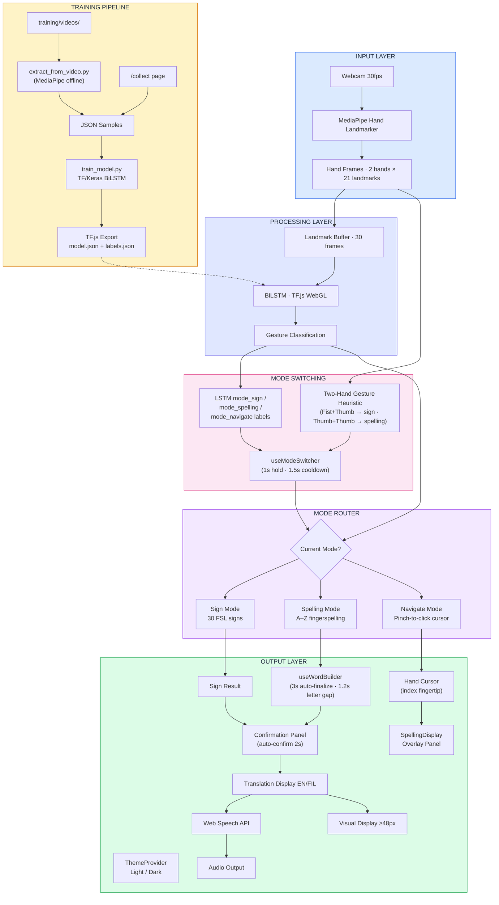
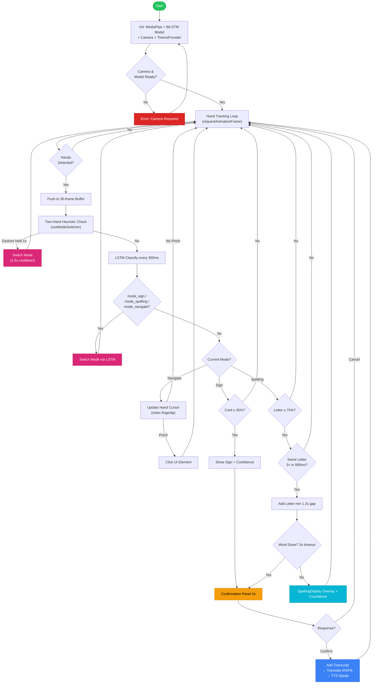
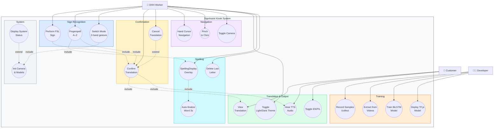

# SignAssist — System Diagrams

---

## 1. System Flowchart



---

## 2. Program Flowchart



---

## 3. Use Case Diagram



---

## 4. Exporting Diagrams

```bash
npx @mermaid-js/mermaid-cli mmdc -i DIAGRAMS.md -o diagrams.pdf
```
